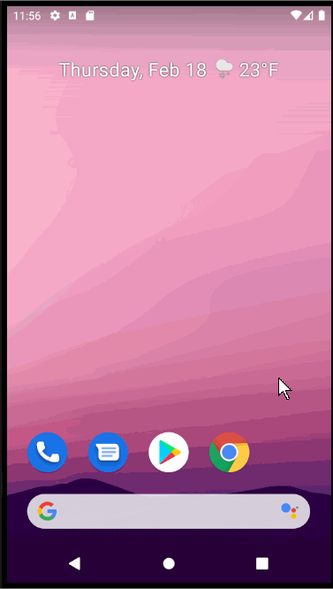

**Flixster** is an android app that shows a list of movies with their posters, overviews and trailers
Submitted by: **Yang Xu**

Time spent: **10** hours spent in total

## User Stories

The following **required** functionality is completed:

* [x] User can **view a list of movies as well as their posters in a list format**
* [x] User can **rotate the screen in an alternative landscape mode**
* [X] User can **click into a movie to see the trailer video, ratings and overview**

## Video Walkthrough

Here's a walkthrough of implemented user stories:

GIF created with [LiceCap](http://www.cockos.com/licecap/).

## Notes

Because it is a first android application of the baby developer, even with the code of video tutorial I took a whole day working on it
trying to understand what I was doing and answer many whys. After this project I noticed that my course in Java OOP really applies in
industrial area. I should dive deeper into the subject from now on.

## License

    Copyright [yyyy] [name of copyright owner]

    Licensed under the Apache License, Version 2.0 (the "License");
    you may not use this file except in compliance with the License.
    You may obtain a copy of the License at

        http://www.apache.org/licenses/LICENSE-2.0

    Unless required by applicable law or agreed to in writing, software
    distributed under the License is distributed on an "AS IS" BASIS,
    WITHOUT WARRANTIES OR CONDITIONS OF ANY KIND, either express or implied.
    See the License for the specific language governing permissions and
    limitations under the License.
